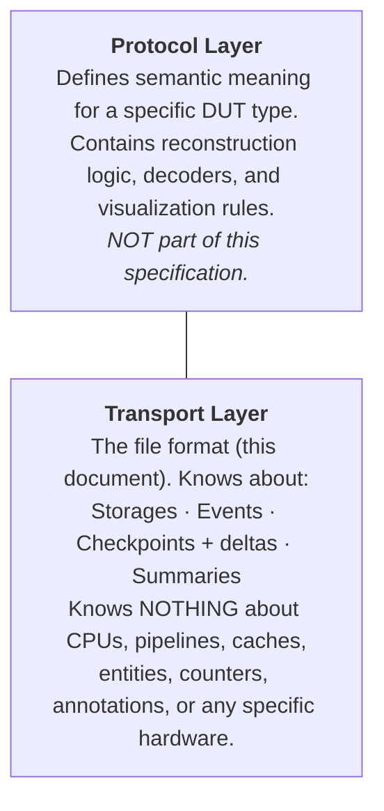
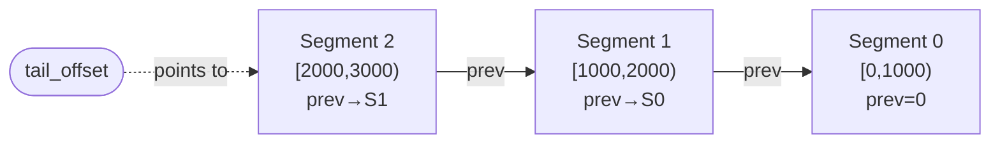

# µScope Trace Format Specification

**Version:** 4.0-draft
**Magic:** `uSCP` (0x75 0x53 0x43 0x50)
**Byte order:** Little-endian (all multi-byte integers throughout the file,
including field values in event payloads, checkpoint slot data, and summary
entries)
**Alignment:** All section offsets are 8-byte aligned

---

## 1. Overview

µScope is a binary trace format for cycle-accurate hardware introspection.

### 1.1 Layered Architecture

µScope is structured as two distinct layers:



The protocol layer defines semantics, decoders, and visualization. The
transport layer defines the binary format and read/write APIs.

### 1.2 Core Primitives

| Primitive   | What it models                                |
| ----------- | --------------------------------------------- |
| **Storage** | A named array of typed slots                  |
| **Event**   | A timestamped occurrence with a typed payload |

All primitives are **schema-defined**. The transport layer imposes no
assumptions about their fields, types, or semantics.

Everything else — entities, counters, annotations, dependencies, markers —
is modeled using these two primitives and interpreted by the protocol layer.

### 1.3 String Representation

All human-readable strings in the format (field names, enum labels, DUT
properties, etc.) are stored in a single **string pool**. Structures
reference strings by `uint16_t` offset into the pool (max 64 KB, sufficient
for any realistic schema).

The string pool is null-terminated UTF-8 sequences packed sequentially,
stored at the end of the schema chunk payload. Both the DUT descriptor and
schema definitions reference it.

The optional string table section (§7) stores runtime strings referenced by
`FT_STRING_REF` fields in delta data.

### 1.4 File Layout

The file has two regions: a **fixed preamble** written at trace creation,
and an **append region** that grows during simulation.

```svgbob
+----------------------------+
|      File Header           |  48 B
+----------------------------+
|      Preamble Chunks       |
|  +----------------------+  |
|  |  CHUNK_DUT_DESC      |  |
|  |  CHUNK_SCHEMA        |  |
|  |  CHUNK_TRACE_CONFIG  |  |
|  |  CHUNK_END           |  |
|  +----------------------+  |
+----------------------------+
|      Segment 0             |
|  +----------------------+  |
|  |  Segment Header      |  |  56 B
|  |  Checkpoint          |  |
|  |  Deltas              |  |
|  +----------------------+  |
+----------------------------+
|      Segment 1             |
|  +----------------------+  |
|  |  Segment Header      |  |  56 B
|  |  Checkpoint          |  |
|  |  Deltas              |  |
|  +----------------------+  |
+----------------------------+
|      ...                   |
+----------------------------+
|      String Table          |
+----------------------------+
|      Summary Section       |
+----------------------------+
|      Segment Table         |
+----------------------------+
|      Section Table         |
+----------------------------+
```

During simulation, only segments are appended. At close, finalization
data is written and the file header is rewritten with final values.

### 1.5 Access Patterns

µScope supports three access patterns:

| Pattern             | When                          | Mechanism                             |
| ------------------- | ----------------------------- | ------------------------------------- |
| **Streaming write** | During simulation             | Append segments, update `tail_offset` |
| **Live read**       | While writer is still running | Follow `tail_offset` → `prev` chain   |
| **Random access**   | After finalization            | Binary search segment table           |

See §8 for details.

---

## 2. File Header

Offset 0. Fixed size: **48 bytes.**

```c
typedef struct {
    uint8_t  magic[4];              // "uSCP" = {0x75, 0x53, 0x43, 0x50}
    uint16_t version_major;         // 4
    uint16_t version_minor;         // 0
    uint64_t flags;                 // §2.1
    uint64_t total_cycles;          // 0 until finalized
    uint32_t num_segments;          // updated after each segment flush
    uint32_t preamble_end;          // file offset where segments begin
    uint64_t section_table_offset;  // 0 until finalized
    uint64_t tail_offset;           // file offset of last segment header (0 = none)
} file_header_t;                    // 48 bytes
```

The preamble (§2.3) immediately follows the header at offset 48 and
extends to `preamble_end`. Readers scan preamble chunks to locate the
DUT descriptor, schema, and trace configuration.

### 2.1 Flags

| Bit  | Name            | Description                        |
| ---- | --------------- | ---------------------------------- |
| 0    | `F_COMPLETE`    | Trace was cleanly finalized        |
| 1    | `F_COMPRESSED`  | Delta segments use compression     |
| 2    | `F_HAS_STRINGS` | String table section present       |
| 3-5  | `F_COMP_METHOD` | Compression method (0=LZ4, 1=ZSTD; 2–7 reserved, must not be used) |
| 6    | `F_COMPACT_DELTAS` | Delta blobs may contain compact ops (§8.6.3) |
| 7-63 | Reserved        | Must be zero                       |

### 2.2 Header Lifecycle

| Field                  | At open            | After each segment    | At close               |
| ---------------------- | ------------------ | --------------------- | ---------------------- |
| `magic`                | `uSCP`             | —                     | —                      |
| `flags`                | `F_COMPRESSED` etc | —                     | `F_COMPLETE` set       |
| `total_cycles`         | 0                  | —                     | final value            |
| `num_segments`         | 0                  | incremented           | final value            |
| `preamble_end`         | final value        | —                     | —                      |
| `section_table_offset` | 0                  | —                     | final offset           |
| `tail_offset`          | 0                  | offset of new segment | offset of last segment |

After fully writing a segment, the writer commits it in this order:

1. Write segment data (header + checkpoint + deltas) at EOF
2. Memory barrier / `fsync`
3. Write `tail_offset` (single 8-byte aligned write — the **commit point**)
4. Write `num_segments` (single 8-byte aligned write — advisory)

A live reader uses `tail_offset` as the sole authoritative indicator of
new data. `num_segments` may lag by one during live reads.

### 2.3 Preamble Chunks

The preamble immediately follows the file header (offset 48) and consists
of a sequence of typed chunks. Each chunk has an 8-byte header:

```c
typedef struct {
    uint16_t type;                  // chunk type
    uint16_t flags;                 // must be 0 (reserved for future use)
    uint32_t size;                  // payload size in bytes
    // uint8_t payload[size];
    // padding to 8-byte alignment (0-filled)
} preamble_chunk_t;                 // 8 bytes + payload + padding
```

Chunk payloads are padded to 8-byte alignment. The next chunk starts at
offset `8 + align8(size)` from the current chunk header.

```c
enum preamble_chunk_type : uint16_t {
    CHUNK_END          = 0x0000,    // terminates the preamble
    CHUNK_DUT_DESC     = 0x0001,    // DUT descriptor (§3)
    CHUNK_SCHEMA       = 0x0002,    // schema definition (§4)
    CHUNK_TRACE_CONFIG = 0x0003,    // trace session parameters (§2.4)
    // future: CHUNK_ELF, CHUNK_SOURCE_MAP, ...
};
```

**Mandatory chunks:** A valid file must contain exactly one each of
`CHUNK_DUT_DESC`, `CHUNK_SCHEMA`, and `CHUNK_TRACE_CONFIG`. Readers
must reject files missing any of these.

**Unknown chunks:** Readers must skip chunk types they do not recognize
(advance by `8 + align8(size)` bytes). This allows older readers to
open files written by newer writers that add new chunk types.

**Ordering:** Writers should emit chunks in the order DUT → Schema →
Trace Config, but readers must not depend on ordering.

### 2.4 Trace Configuration Chunk

Session-level parameters that govern how the trace was captured.

```c
typedef struct {
    uint32_t checkpoint_interval;   // cycles between checkpoints
    uint32_t reserved;              // must be 0
} trace_config_t;                   // 8 bytes (CHUNK_TRACE_CONFIG payload)
```

---

## 3. DUT Descriptor

`CHUNK_DUT_DESC` payload. Identifies what is being traced.

```c
typedef struct {
    uint16_t num_properties;
    uint16_t reserved;              // must be 0
    // dut_property_t properties[num_properties];
} dut_desc_t;                       // 4 bytes + properties
```

### 3.1 DUT Properties

```c
typedef struct {
    uint16_t key;                   // offset into string pool
    uint16_t value;                 // offset into string pool
} dut_property_t;                   // 4 bytes
```

Properties are opaque key-value pairs. The transport layer does not interpret
them — only the protocol layer does. Protocol version, vendor, DUT name, and
any domain-specific metadata are all properties.

Example properties for an OoO CPU:

| Key                | Value             |
| ------------------ | ----------------- |
| `dut_name`         | `boom_core_0`     |
| `vendor`           | `acme`            |
| `protocol_version` | `1.0.0`           |
| `isa`              | `RV64IMAFDCV`     |
| `pipeline_depth`   | `12`              |
| `elf_path`         | `/path/to/fw.elf` |

---

## 4. Schema

`CHUNK_SCHEMA` payload. The schema defines the structure of all data in
the trace. Written once at trace creation, immutable thereafter. Fully
self-describing — a viewer can parse and display data without a protocol
plugin.

### 4.1 Schema Header

```c
typedef struct {
    uint8_t  num_enums;             // max 255 enum types
    uint8_t  reserved0;
    uint16_t num_scopes;
    uint16_t num_storages;
    uint16_t num_event_types;
    uint16_t num_summary_fields;
    uint16_t string_pool_offset;    // offset from schema start to string pool
    // Followed by, in order:
    //   scope_def_t             scopes[num_scopes]
    //   enum_def_t              enums[num_enums]              (variable-size)
    //   storage_def_t           storages[num_storages]        (variable-size)
    //   event_def_t             event_types[num_event_types]  (variable-size)
    //   summary_field_def_t     summary_fields[num_summary_fields]
    //   <string pool>
} schema_header_t;                  // 14 bytes
```

### 4.2 Field Types

```c
enum field_type : uint8_t {
    FT_U8           = 0x01,
    FT_U16          = 0x02,
    FT_U32          = 0x03,
    FT_U64          = 0x04,
    FT_I8           = 0x05,
    FT_I16          = 0x06,
    FT_I32          = 0x07,
    FT_I64          = 0x08,
    FT_BOOL         = 0x09,         // 1 byte
    FT_STRING_REF   = 0x0A,         // uint32_t offset into string table section
    FT_ENUM         = 0x0B,         // uint8_t index into a named enum
};
```

### 4.3 Field Definition

```c
typedef struct {
    uint16_t name;                  // offset into string pool
    uint8_t  type;                  // field_type (size derived from type)
    uint8_t  enum_id;               // if type==FT_ENUM, else 0
    uint8_t  reserved[4];
} field_def_t;                      // 8 bytes
```

Field size is derived from the type:

| Type          | Size (bytes) |
| ------------- | ------------ |
| FT_U8, FT_I8, FT_BOOL, FT_ENUM | 1 |
| FT_U16, FT_I16 | 2 |
| FT_U32, FT_I32, FT_STRING_REF | 4 |
| FT_U64, FT_I64 | 8 |

### 4.4 Scope Definition

Scopes define a hierarchical tree for organizing storages and events.
The schema must contain at least one scope: scope 0 is the **root
scope** (conventionally named `/`).

```c
typedef struct {
    uint16_t name;              // offset into string pool
    uint16_t scope_id;          // 0-based; scope 0 = root
    uint16_t parent_id;         // parent scope_id, 0xFFFF = root (only valid for scope 0)
    uint16_t protocol;          // offset into string pool, 0xFFFF = no protocol
} scope_def_t;                  // 8 bytes
```

Each scope optionally declares a **protocol** — a string identifying
which protocol layer applies (e.g., `"cpu"`, `"dma"`, `"noc"`). The
viewer uses the protocol to select the appropriate plugin for that
subtree. Scopes with `protocol = 0xFFFF` have no protocol and are
rendered generically.

There is no protocol inheritance. Each scope that needs a protocol must
declare it explicitly. The root scope typically has no protocol.

**Protocol identifiers:** Vendor-specific protocols use a dotted
prefix: `axelera.loom_core`. The protocol `generic` (or no protocol)
means the viewer renders raw schema data without interpretation.

### 4.5 Enum Definition

```c
typedef struct {
    uint16_t name;                  // offset into string pool
    uint8_t  num_values;
    uint8_t  reserved;
    // enum_value_t values[num_values];
} enum_def_t;                       // 4 bytes + values

typedef struct {
    uint8_t  value;                 // numeric value
    uint8_t  reserved;
    uint16_t name;                  // offset into string pool
} enum_value_t;                     // 4 bytes
```

### 4.6 Storage Definition

```c
typedef struct {
    uint16_t name;                  // offset into string pool
    uint16_t storage_id;            // 0-based
    uint16_t num_slots;
    uint16_t num_fields;
    uint16_t flags;                 // §4.6.1
    uint16_t scope_id;              // owning scope, 0xFFFF = root-level
    // field_def_t fields[num_fields];
} storage_def_t;                    // 12 bytes + fields
```

#### 4.6.1 Storage Flags

| Bit  | Name        | Description                                    |
| ---- | ----------- | ---------------------------------------------- |
| 0    | `SF_SPARSE` | Checkpoints store only valid entries + bitmask |
| 1-15 | Reserved    |                                                |

For `SF_SPARSE` storages, slot validity is tracked by the transport:
- `DA_SLOT_SET` on any field of an invalid slot implicitly marks it valid.
- `DA_SLOT_CLEAR` marks a slot invalid.

Non-sparse storages have all slots always valid.

### 4.7 Event Definition

```c
typedef struct {
    uint16_t name;                  // offset into string pool
    uint16_t event_type_id;         // 0-based
    uint16_t num_fields;
    uint16_t scope_id;              // owning scope, 0xFFFF = root-level
    // field_def_t fields[num_fields];
} event_def_t;                      // 8 bytes + fields
```

### 4.8 Summary Field Definition

```c
typedef struct {
    uint16_t name;                  // offset into string pool
    uint8_t  type;                  // field_type (size derived from type, see §4.3)
    uint8_t  reserved[5];
} summary_field_def_t;              // 8 bytes
```

Summary fields are opaque to the transport. The writer computes and writes
values; the transport stores and retrieves them. What each field means
(counter rate, storage occupancy, event frequency) is the protocol layer's
concern.

---

## 5. Section Table

Written at finalization only (when `F_COMPLETE` is set).

```c
enum section_type : uint16_t {
    SECTION_END          = 0x0000,
    SECTION_SUMMARY      = 0x0001,
    SECTION_STRINGS      = 0x0002,
    SECTION_SEGMENTS     = 0x0003,
};

typedef struct {
    uint16_t type;
    uint16_t flags;
    uint32_t reserved;
    uint64_t offset;
    uint64_t size;
} section_entry_t;                  // 24 bytes
```

The table is terminated by a `SECTION_END` entry.

For incomplete files (`F_COMPLETE` not set), `section_table_offset` is 0
and the section table does not exist. Readers must use the segment chain
(§8.2) to discover segments.

---

## 6. Summary Section (Mipmap Pyramid)

Written at finalization only.

### 6.1 Summary Header

```c
typedef struct {
    uint32_t num_levels;
    uint32_t base_interval;         // level 0 bucket size in cycles
    uint32_t fan_out;               // reduction factor per level
    uint32_t entry_size;            // computed from summary field defs
    // level_desc_t levels[num_levels];
} summary_header_t;

typedef struct {
    uint64_t offset;                // relative to summary section start
    uint32_t num_entries;
    uint32_t reserved;
} level_desc_t;                     // 16 bytes
```

### 6.2 Summary Entry

Layout determined by `summary_field_def_t[]`:

```c
// Pseudo-layout:
typedef struct {
    uint64_t cycle_start;
    // For each summary_field_def:
    //   value at field's size bytes
} summary_entry_t;
```

---

## 7. String Table (Optional)

For runtime strings referenced by `FT_STRING_REF` fields in storage slots
or event payloads. Written at finalization.

```c
typedef struct {
    uint32_t num_entries;
    uint32_t reserved;
    // string_index_t entries[num_entries];
    // followed by packed null-terminated string data
} string_table_header_t;

typedef struct {
    uint64_t key;
    uint32_t offset;
    uint32_t reserved;
} string_index_t;                   // 16 bytes
```

---

## 8. Segments

A segment is one checkpoint-interval's worth of data: a full state snapshot
(checkpoint) followed by compressed cycle-by-cycle deltas.

### 8.1 Segment Header

Each segment is self-describing and linked to the previous segment,
forming a backward chain.

```c
typedef struct {
    uint32_t segment_magic;         // "uSEG" = {0x75, 0x53, 0x45, 0x47}
    uint32_t flags;
    uint64_t cycle_start;
    uint64_t cycle_end;             // exclusive
    uint64_t prev_segment_offset;   // file offset of previous segment (0 = first)
    uint32_t checkpoint_size;
    uint32_t deltas_compressed_size;
    uint32_t deltas_raw_size;
    uint32_t num_cycle_frames;      // number of cycle_frame records in decompressed delta blob
    uint32_t num_cycles_active;
    uint32_t reserved;
    // checkpoint data (checkpoint_size bytes)
    // compressed delta data (deltas_compressed_size bytes)
} segment_header_t;                 // 56 bytes
```

The `segment_magic` field allows validation when walking the chain and
recovery of incomplete files.

### 8.2 Segment Chain

Segments form a singly-linked list via `prev_segment_offset`, traversable
from `tail_offset` in the file header backward to the first segment
(`prev_segment_offset == 0`).



### 8.3 Segment Table (Finalization Only)

At close, the writer builds a flat segment table for fast random access.
This table is referenced by `SECTION_SEGMENTS` in the section table.

```c
typedef struct {
    uint64_t offset;                // file offset of segment_header_t
    uint64_t cycle_start;
    uint64_t cycle_end;             // exclusive
} segment_index_entry_t;            // 24 bytes
```

Binary search on `cycle_start` gives O(log n) seek to any cycle.

### 8.4 Reading Strategies

**Finalized file** (`F_COMPLETE` set):
1. Read file header → `preamble_end`, `section_table_offset`
2. Scan preamble chunks → extract DUT, schema, trace config
3. Read section table → find `SECTION_SEGMENTS`
4. Binary search segment table for target cycle → get segment offset
5. Read segment header + checkpoint + deltas at that offset

**Live file** (`F_COMPLETE` not set):
1. Read file header → `preamble_end`, `tail_offset`
2. Scan preamble chunks → extract DUT, schema, trace config
3. Read segment at `tail_offset` → follow `prev_segment_offset` chain
4. Build in-memory segment index (done once, O(n) in segments)
5. To check for new data: re-read `tail_offset` from file header

**Streaming write** (writer perspective):
1. Write file header (with `tail_offset=0`) + preamble chunks + CHUNK_END
2. Set `preamble_end` in file header
3. For each checkpoint interval:
   a. Write `segment_header_t` + checkpoint + compressed deltas at EOF
   b. Rewrite `tail_offset` and `num_segments` in file header
4. At close: write string table, summary, segment table, section table;
   set `F_COMPLETE`; rewrite file header with final values

### 8.5 Checkpoint Format

A checkpoint is a sequence of storage blocks, one per storage.

```c
typedef struct {
    uint16_t storage_id;
    uint16_t reserved;
    uint32_t size;                  // payload size in bytes
    // payload
} checkpoint_block_t;               // 8 bytes
```

#### 8.5.1 Sparse Storage Block

```
checkpoint_block_t { storage_id, size }
uint8_t  valid_mask[ceil(num_slots/8)];
// For each set bit: slot_data[slot_size]
```

#### 8.5.2 Dense Storage Block

```
checkpoint_block_t { storage_id, size }
// slot_data[slot_size] × num_slots
```

### 8.6 Delta Format

#### 8.6.1 Cycle Frame

Wire format (variable-length — not representable as a C struct):

```
cycle_frame:
  [LEB128]   cycle_delta     1–10 bytes, unsigned delta from previous frame
  [uint8]    op_format       0 = wide (16B delta_op_t), 1 = compact (8B delta_op_compact_t)
  [uint8]    reserved        must be 0
  [uint16]   num_ops
  [uint16]   num_events
  [repeated] ops             × num_ops  (size per op depends on op_format)
  [repeated] events          × num_events (event_record_t, variable-size)
```

The `op_format` field is only meaningful when `F_COMPACT_DELTAS` is set
in the file header. If the flag is not set, `op_format` must be 0 (wide)
and readers may skip checking it.

The cycle delta uses **unsigned LEB128** encoding (same as DWARF / protobuf):

| Delta value | Encoded bytes | Typical scenario              |
| ----------- | ------------- | ----------------------------- |
| 0           | 1 (0x00)      | Multiple frames at same cycle |
| 1           | 1 (0x01)      | Consecutive-cycle activity    |
| 2–127       | 1             | Small gaps                    |
| 128–16383   | 2             | Moderate gaps                 |
| 16384+      | 3+            | Large idle gaps (rare)        |

The first frame in each segment uses `segment_header_t.cycle_start` as the
base, so each segment is independently decodable without prior context.

#### 8.6.2 Delta Operations

```c
enum delta_action : uint8_t {
    DA_SLOT_SET     = 0x01,         // set a field value
    DA_SLOT_CLEAR   = 0x02,         // mark slot invalid (sparse only)
    DA_SLOT_ADD     = 0x03,         // add value to field (for counters etc.)
};

typedef struct {
    uint8_t  action;
    uint8_t  reserved;
    uint16_t storage_id;
    uint16_t slot_index;
    uint16_t field_index;           // ignored for DA_SLOT_CLEAR
    uint64_t value;                 // ignored for DA_SLOT_CLEAR
} delta_op_t;                       // 16 bytes
```

#### 8.6.3 Compact Delta Variant

When the file header flag `F_COMPACT_DELTAS` is set, delta blobs may
contain compact 8-byte ops. The `op_format` field in `cycle_frame_t`
(§8.6.1) determines which layout all ops in that frame use.

```c
typedef struct {
    uint8_t  action;
    uint8_t  storage_id_lo;         // low 8 bits of storage_id
    uint16_t slot_index;
    uint16_t field_index;
    uint16_t value16;
} delta_op_compact_t;               // 8 bytes
```

Compact ops are limited to `storage_id` 0–255. Writers must use wide ops
for frames that reference storages with ID ≥ 256.

#### 8.6.4 Event Records

```c
typedef struct {
    uint16_t event_type_id;
    uint16_t reserved;              // must be 0
    uint32_t payload_size;
    // uint8_t payload[payload_size];
} event_record_t;
```

#### 8.6.5 Payload Wire Format

Event payloads and checkpoint slot data use the same packing rule:
fields are concatenated in schema-definition order with **no padding and
no alignment**. Multi-byte fields use little-endian byte order (as with
all integers in the file). The total payload size equals the sum of all
field sizes as derived from their types (see §4.3).

Checkpoint blocks (§8.5) and cycle frames within the delta blob are also
tightly packed with no inter-block or intra-block padding.

#### 8.6.6 Compression

Per-segment, single LZ4 or ZSTD block. Method indicated in file header
flags. Readers must reject files with unknown `F_COMP_METHOD` values.

---

## 9. Writer API

```c
// ── Lifecycle ──
uscope_writer_t* uscope_writer_open(const char* path,
                                     const dut_desc_t* dut,
                                     const schema_t* schema,
                                     uint32_t checkpoint_interval);
void             uscope_writer_close(uscope_writer_t* w);

// ── Per-cycle ──
void uscope_begin_cycle(uscope_writer_t* w, uint64_t cycle);

void uscope_slot_set(uscope_writer_t* w, uint16_t storage_id,
                      uint16_t slot, uint16_t field, uint64_t value);
void uscope_slot_clear(uscope_writer_t* w, uint16_t storage_id,
                        uint16_t slot);
void uscope_slot_add(uscope_writer_t* w, uint16_t storage_id,
                      uint16_t slot, uint16_t field, uint64_t value);

void uscope_event(uscope_writer_t* w, uint16_t event_type_id,
                   const void* payload);

void uscope_end_cycle(uscope_writer_t* w);

// ── Checkpoints ──
typedef void (*uscope_checkpoint_fn)(uscope_writer_t* w, void* user_data);
void uscope_set_checkpoint_callback(uscope_writer_t* w,
                                     uscope_checkpoint_fn fn, void* ud);
void uscope_checkpoint_storage(uscope_writer_t* w, uint16_t storage_id,
                                const uint8_t* valid_mask,
                                const void* slot_data,
                                uint32_t num_valid_slots);
```

### 9.1 DPI Bridge

The transport-level DPI is generic. Protocol-specific convenience wrappers
are defined by each protocol, not by this spec.

```systemverilog
import "DPI-C" function chandle uscope_open(string path);
import "DPI-C" function void    uscope_close(chandle w);

import "DPI-C" function void    uscope_begin_cycle(chandle w, longint unsigned cycle);
import "DPI-C" function void    uscope_end_cycle(chandle w);

import "DPI-C" function void    uscope_slot_set(
    chandle w, shortint unsigned storage_id, shortint unsigned slot,
    shortint unsigned field, longint unsigned value
);
import "DPI-C" function void    uscope_slot_clear(
    chandle w, shortint unsigned storage_id, shortint unsigned slot
);
import "DPI-C" function void    uscope_slot_add(
    chandle w, shortint unsigned storage_id, shortint unsigned slot,
    shortint unsigned field, longint unsigned value
);

import "DPI-C" function void    uscope_event_raw(
    chandle w, shortint unsigned event_type_id,
    input byte unsigned payload[]
);
```

---

## 10. Reader API

```c
// ── Lifecycle ──
uscope_reader_t* uscope_reader_open(const char* path);
void             uscope_reader_close(uscope_reader_t* r);

// ── Metadata ──
const file_header_t*  uscope_header(const uscope_reader_t* r);
const dut_desc_t*     uscope_dut_desc(const uscope_reader_t* r);
const schema_t*       uscope_schema(const uscope_reader_t* r);
const char*           uscope_protocol(const uscope_reader_t* r);
const char*           uscope_dut_property(const uscope_reader_t* r,
                                           const char* key);
bool                  uscope_is_complete(const uscope_reader_t* r);

// ── Summary (finalized files only) ──
uint32_t    uscope_summary_levels(const uscope_reader_t* r);
const void* uscope_summary_data(const uscope_reader_t* r, uint32_t level,
                                 uint32_t* out_count);

// ── State reconstruction ──
uscope_state_t* uscope_state_at(uscope_reader_t* r, uint64_t cycle);
void            uscope_state_free(uscope_state_t* s);

bool     uscope_slot_valid(const uscope_state_t* s, uint16_t storage_id,
                            uint16_t slot);
uint64_t uscope_slot_field(const uscope_state_t* s, uint16_t storage_id,
                            uint16_t slot, uint16_t field);
uint32_t uscope_storage_occupancy(const uscope_state_t* s,
                                   uint16_t storage_id);

// ── Events ──
uscope_event_iter_t* uscope_events_in_range(uscope_reader_t* r,
                                             uint64_t cycle_start,
                                             uint64_t cycle_end);
bool uscope_event_next(uscope_event_iter_t* it, uint64_t* cycle,
                        uint16_t* event_type_id, const void** payload);
void uscope_event_iter_free(uscope_event_iter_t* it);

// ── Live tailing ──
bool uscope_poll_new_segments(uscope_reader_t* r);
```

---

## 11. Konata Trace Reconstruction

This section demonstrates that µScope carries all information needed to
reconstruct a Konata-format pipeline visualization using only storages and
events.

### 11.1 Protocol-Level Modeling

An `ooo_cpu` protocol models pipeline concepts using transport primitives:

| Concept          | Transport model                                                                                |
| ---------------- | ---------------------------------------------------------------------------------------------- |
| Entity catalog   | A storage (e.g. `entities`) with one slot per entity. Fields: `pc`, `opcode`, etc.             |
| Pipeline stages  | Storages representing structures (ROB, IQ, etc.). Slots contain entity IDs as `FT_U64` fields. |
| Entity lifecycle | Entity ID appears via `DA_SLOT_SET`, disappears via `DA_SLOT_CLEAR`                            |
| Annotations      | Events with entity ID as a field (e.g. `annotate_text` event type)                             |
| Dependencies     | Events with `(source_id, target_id, dep_type)` fields                                          |
| Flush/squash     | Events with `(entity_id, reason)` fields                                                       |
| Counters         | 1-slot storages with a numeric field, mutated via `DA_SLOT_ADD`                                |

### 11.2 Konata Command Mapping

| Konata cmd        | µScope equivalent                                                 |
| ----------------- | ----------------------------------------------------------------- |
| `I` (create)      | `DA_SLOT_SET` writing an entity ID into a stage storage           |
| `L` (label)       | Fields in the entity catalog storage (decoded by protocol plugin) |
| `S` (stage start) | `DA_SLOT_SET` placing entity ID into a new storage (entity moves) |
| `E` (stage end)   | Inferred: slot cleared or entity ID overwritten                   |
| `R` (retire)      | `DA_SLOT_CLEAR` on last storage, or a retire event                |
| `W` (flush)       | A flush event with entity ID                                      |
| `C` (cycle)       | Decoded absolute cycle (segment base + cumulative LEB128 deltas)  |
| Dependency arrows | Dependency events linking entity IDs                              |

### 11.3 Reconstruction Algorithm

To render a Konata-style Gantt chart for a range of entities:

1. Load the segment(s) covering the cycle range of interest
2. Replay deltas, tracking per-entity stage transitions:
   - When an entity ID appears in a storage slot → record stage entry
   - When the entity ID disappears (slot cleared or overwritten) → record stage exit
3. For each entity, the sequence of `(stage, cycle_start, cycle_end)` tuples gives the Gantt bars
4. Entity labels come from the entity catalog storage + protocol decoder
5. Dependency arrows come from dependency events
6. Flush/squash markers come from flush events

This reconstruction happens in the **protocol plugin**, not in the transport
layer.

---

## 12. Design Rationale

1. **Two primitives:** Storages and events are sufficient to model any
   time-series structured data. Entities, counters, annotations, and
   dependencies are protocol-level patterns built on top.

2. **Two-layer architecture:** Format never changes when adding DUT types.
   Only new protocol specs are written.

3. **Schema-driven, self-describing:** Unknown protocols render generically.

4. **String pool:** Arbitrary-length names, no wasted padding, smaller
   structs. One pool shared by DUT descriptor and schema.

5. **No styling in transport:** Colors, line styles, layout rules, display
   hints (hex, hidden, key) belong in the protocol layer or viewer
   configuration. The transport layer is pure data.

6. **Append-only segments with backward chain:** Segments are appended
   during simulation with no pre-allocated tables. A `tail_offset` in the
   file header lets readers discover new segments. At finalization, a flat
   segment table is built for fast random access. This supports streaming
   write, live read, and fast seek — all from a single file.

7. **Checkpoint + delta:** O(1) seek to segment, O(n) replay within
   segment. Cycle timestamps are LEB128 delta-encoded — 1 byte per frame
   for consecutive cycles instead of 8.

8. **Mipmap summaries:** O(screen_pixels) overview rendering. Summary
   semantics are opaque to the transport — the protocol layer defines what
   each field means.

9. **Single file, section-based:** Portable, self-locating sections.
   No sidecar files.

10. **Chunked preamble:** DUT descriptor, schema, and trace config are
    typed chunks with length headers. Older readers skip unknown chunk
    types, so new metadata can be added (embedded ELF, source maps,
    protocol config) without bumping the format version.

11. **Scoped hierarchy with per-scope protocols:** Storages and events
    are organized into a tree of scopes rooted at `/` (matching
    hardware hierarchy: SoC → tile → core). Each scope can declare
    its own protocol, enabling mixed-protocol traces (CPU + DMA + NoC
    in one file). No inheritance — each scope is explicit.

---

## 13. Comparison with FST

### 13.1 Core Difference: Signals vs. Structures

| Aspect            | FST                        | µScope                                 |
| ----------------- | -------------------------- | -------------------------------------- |
| **Data model**    | Flat signals (bit-vectors) | Typed structures + protocol semantics  |
| **Semantics**     | None                       | Schema (transport) + protocol (domain) |
| **Aggregation**   | External post-processing   | Built-in mipmaps                       |
| **Extensibility** | New signals only           | New protocols, same format             |

### 13.2 When FST is Better

- Signal-level debugging (exact wire values)
- RTL verification (waveform comparison)
- Tool ecosystem (GTKWave, Surfer, DVT)
- Zero instrumentation cost (`$dumpvars`)

### 13.3 When µScope is Better

- Microarchitectural introspection
- Large structures (1024-entry ROB = one sparse storage)
- Performance analysis with built-in summaries
- Billion-cycle interactive exploration
- Non-RTL environments (architectural simulators)
- Multiple DUT types with one format

### 13.4 Complementary Use

| Phase                 | Tool             | Why                                  |
| --------------------- | ---------------- | ------------------------------------ |
| RTL signal debug      | FST + GTKWave    | Bit-accurate, zero setup             |
| Microarch exploration | µScope viewer    | Structured, schema-aware             |
| Performance analysis  | µScope summaries | Multi-resolution aggregation         |
| Bug root-cause        | µScope → FST     | Find cycle in µScope, drill into FST |

---

## 14. Version History

| Version | Date       | Changes                                                   |
| ------- | ---------- | --------------------------------------------------------- |
| 1.0     | 2025-xx-xx | Initial draft (CPU-specific)                              |
| 2.0     | 2025-xx-xx | Architecture-agnostic, schema-driven                      |
| 3.0     | 2025-xx-xx | Transport/protocol layer separation                       |
| 3.1     | 2025-xx-xx | String pools, styling removed, Konata proof               |
| 4.0     | 2025-xx-xx | Aggressive simplification:                                |
|         |            | — Entities removed (modeled as storages)                  |
|         |            | — Annotations removed (modeled as events)                 |
|         |            | — Counters removed (modeled as 1-slot storages)           |
|         |            | — SF_CIRCULAR, SF_CAM removed (head/tail = fields)        |
|         |            | — DA_HEAD, DA_TAIL, DA_COUNTER_* removed                  |
|         |            | — Field/event/counter display flags removed               |
|         |            | — Summary source/aggregation semantics removed            |
|         |            | — Two string pools merged into one                        |
|         |            | — DUT descriptor simplified (vendor/version = properties) |
|         |            | — Delta actions: 7 → 3 (SET, CLEAR, ADD)                  |
|         |            | — Section types: 7 → 4                                    |
|         |            | — LEB128 delta-encoded cycle in cycle frames              |
|         |            | — Append-only segment chain with `tail_offset`            |
|         |            | — Live read support (no finalization required)            |
|         |            | — Segment table moved to finalization-only                |
| 4.1     | 2026-xx-xx | Chunked preamble:                                         |
|         |            | — File header: 64 → 48 bytes                              |
|         |            | — DUT descriptor, schema, trace config become chunks      |
|         |            | — `dut_desc_offset`, `schema_offset` removed from header  |
|         |            | — `checkpoint_interval` moved to CHUNK_TRACE_CONFIG       |
|         |            | — `dut_desc_t.size`, `schema_header_t.size` removed       |
|         |            | — Unknown chunk types skipped (forward compatibility)     |
|         |            | — `storage_id` widened to uint16 throughout               |
|         |            | — `num_enums` narrowed to uint8                           |
|         |            | — `field_def_t.size` removed (derived from type)          |
|         |            | — Compact deltas: per-frame `op_format` + file flag       |
|         |            | — `num_deltas` → `num_cycle_frames`                       |
|         |            | — Payload wire format specified (tight packing, LE)       |
|         |            | — Live-read commit ordering specified                     |
|         |            | — Scopes: hierarchical grouping of storages/events        |
|         |            | — Per-scope protocol assignment (multi-protocol traces)   |

---

## 15. Glossary

| Term                | Definition                                                                                                        |
| ------------------- | ----------------------------------------------------------------------------------------------------------------- |
| **Checkpoint**      | Full snapshot of all storage state at a segment boundary. Enables random access without replaying from the start. |
| **Chunk**           | A typed, length-prefixed block in the preamble. Unknown chunk types are skipped for forward compatibility.        |
| **Cycle frame**     | One cycle's worth of delta operations and events, prefixed by a LEB128 cycle delta.                               |
| **Delta**           | A single state change within a cycle frame (`DA_SLOT_SET`, `DA_SLOT_CLEAR`, or `DA_SLOT_ADD`).                    |
| **DUT**             | Device Under Test. The hardware being traced.                                                                     |
| **Event**           | A timestamped occurrence with a schema-defined typed payload. Fire-and-forget (no persistent state).              |
| **Finalization**    | The process of writing summary, string table, segment table, and section table at trace close. Sets `F_COMPLETE`. |
| **LEB128**          | Little-Endian Base 128. Variable-length unsigned integer encoding. Used for cycle deltas.                         |
| **Mipmap**          | Multi-resolution summary pyramid. Each level aggregates the level below by a fan-out factor.                      |
| **Preamble**        | The chunk stream between the file header and the first segment. Contains DUT, schema, and trace config.           |
| **Protocol layer**  | Defines semantic meaning for a specific DUT type (e.g. `cpu`). Assigned per-scope. Not part of this spec.         |
| **Schema**          | Immutable definition of all scopes, storages, events, enums, and summary fields. Written once at creation.        |
| **Scope**           | A named node in a hierarchical tree rooted at `/`. Groups storages and events. Optionally declares a protocol.    |
| **Segment**         | One checkpoint-interval's worth of data: a checkpoint followed by compressed deltas.                              |
| **Slot**            | One entry in a storage array. Contains one value per field defined in the storage schema.                         |
| **Storage**         | A named, fixed-size array of typed slots. State is mutated by deltas and snapshotted in checkpoints.              |
| **String pool**     | Packed, null-terminated UTF-8 strings referenced by `uint16_t` offsets. Shared by DUT descriptor and schema.      |
| **String table**    | Optional section for runtime strings (e.g. disassembled instructions) referenced by `FT_STRING_REF` fields.       |
| **Tail offset**     | File header field pointing to the last completed segment. Updated after each segment flush. Enables live reading. |
| **Transport layer** | The binary file format defined by this spec. Knows about storages, events, and segments — nothing else.           |
